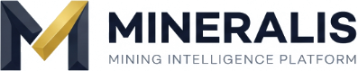

# ⚒️ MINERALIS — Central Operations & Mining Intelligence Platform

<div align="center">



**An enterprise-grade, deterministic AI intelligence platform for mining operations, heavy machinery telematics, and statutory compliance auditing.**

[](https://nextjs.org/)
[](https://fastapi.tiangolo.com/)
[](https://sqlite.org/)
[](https://developer.mozilla.org/en-US/docs/Web/API/WebSockets_API)
[](https://tailwindcss.com/)
[](https://www.typescriptlang.org/)

</div>

---

## 🌟 Executive Summary

**MINERALIS** is a full-stack industrial mining intelligence platform designed for large-scale enterprise mining operations across 8 operational divisions and 315 active mines. It addresses the critical challenge of manual document reconciliation, siloed machine telematics, and opaque calculations in the natural resource sector.

Unlike standard LLM chatbots that hallucinate numbers, **MINERALIS** pairs an AI Assistant (**MIRA — Mining Intelligence & Regulatory Advisor**) with a **Deterministic Mathematical Engine**. Every metric, chart, and generated report links directly to cryptographic SHA-256 evidence citations, exact document page numbers, and OCR bounding boxes.

---

## 🚀 Key Engineering Highlights

### 1. 🤖 MIRA (Mining Intelligence & Regulatory Advisor)
* **Zero-Hallucination Grounding**: Natural language query engine backed by deterministic algebraic verification.
* **Cryptographic Evidence Links**: Every answer includes clickable source document citations (`.pdf`, `.xlsx`, `.docx`) with exact page numbers and table cell references.
* **Autonomous Statutory Risk Certification**: Generates cryptographically verifiable audit seals (`CERT-FY24-XXXX`).

### 2. 🚜 HEMM Heavy Machinery Fleet Digital Twin
* **Live Telemetry WebSocket (`/ws/telematics`)**: Streams real-time 2-second sensor telemetry for Walking Draglines (24/96 Rig), 42m³ Electric Shovels, 240T Dumpers, and Wirtgen Surface Miners.
* **Telemetry Monitored**: Engine RPM, coolant temperature (°C), hydraulic pressure (bar), and vibration (mm/s).
* **Fault Injection Simulator**: Interactive subsystem stress testing with automated fault tripping and maintenance alerts.

### 3. 🗺️ Geospatial Pit GIS & Strata Spatial Map
* **Interactive 3D Topography**: Visualizes open-cast benches, underground seam depths (-120m to +410m RL), and gross calorific values (GCV G4–G12).
* **Live GPS Haulage Tracking**: Real-time vehicle positions and shovel-dumper dispatch monitoring.
* **DGMS Geotechnical Compliance**: Live slope stability factor calculation (FoSL).

### 4. 📑 Split-Screen Document Ingestion & Reconciliation
* **Multi-Format Ingestion**: Ingests PDFs, scanned OCR images, Excel sheets, and Word documents.
* **Bounding-Box Canvas Viewer**: Visualizes exact OCR coordinate layers over original document pages.
* **Reconciliation Diff Engine**: Flags variance between reported vs audited numbers with confidence levels.

### 5. 📊 Automated Statutory Report Generator
* **One-Click Export**: Generates comprehensive PDF and Word (`.docx`) executive reports with embedded audit proof tables.

---

## 🏗️ Architecture & Technology Stack

```
┌────────────────────────────────────────────────────────┐
│             FRONTEND (Next.js 14 / React 18)           │
│                 http://localhost:3000                  │
│                                                        │
│  - Modern Glassmorphism UI (Tailwind CSS)              │
│  - Interactive Recharts & Geospatial SVG Map           │
│  - Global Command Palette (`Ctrl+K` / `⌘K`)            │
│  - Split-Screen OCR Bounding Box Canvas                │
│  - Role-Adaptive Pithead Shift Muster Panel            │
└──────────────┬──────────────────────────▲──────────────┘
               │                          │
    REST API Calls (HTTP)        WebSocket Stream
    JSON Payloads & FormData     Live Telemetry Feed
    `NEXT_PUBLIC_API_URL`        `ws://127.0.0.1:8000/ws/telematics`
               │                          │
┌──────────────▼──────────────────────────┴──────────────┐
│                BACKEND (FastAPI / Uvicorn)             │
│                 http://127.0.0.1:8000                  │
│                                                        │
│  - OCR & Multi-Format Parsing Engine                   │
│  - Deterministic Calculation & Variance Engine         │
│  - Autonomous Statutory Audit Certification (SHA-256)  │
│  - Heavy Equipment Fleet Digital Twin Simulator        │
│  - PDF & DOCX Native Report Generators                 │
└──────────────┬─────────────────────────────────────────┘
               │ SQLAlchemy ORM
┌──────────────▼─────────────────────────────────────────┐
│            PERSISTENCE LAYER (SQLite Database)         │
│               `backend/mining_platform.db`             │
│   (12 tables: documents, metrics, evidence, fleet...)  │
└────────────────────────────────────────────────────────┘
```

---

## ⚡ Quick Start (1-Click Run)

### Method 1: Windows 1-Click Launcher
Double-click `run_mineralis.bat` (or run `./run_mineralis.ps1` in PowerShell). This automatically starts both backend and frontend servers and launches your browser.

### Method 2: Manual Setup

#### 1. Backend Setup:
```powershell
cd backend
python -m venv .venv
.\.venv\Scripts\Activate.ps1
pip install -r requirements.txt
python -m uvicorn app.main:app --host 127.0.0.1 --port 8000 --reload
```

#### 2. Frontend Setup:
```powershell
cd frontend
npm install
npm run dev
```

Open [http://localhost:3000](http://localhost:3000) in your browser.

---

## 📂 Project Structure

```
mining-intelligence-platform/
├── backend/                        # FastAPI Core Backend Service
│   ├── app/
│   │   ├── routers/                # REST & WebSocket API Routers
│   │   │   ├── dashboard_router.py # Executive KPIs & Division Summaries
│   │   │   ├── documents_router.py # OCR Ingestion & Metric Extraction
│   │   │   ├── assistant_router.py # MIRA AI Grounded Assistant
│   │   │   ├── fleet_router.py     # Heavy Machinery Digital Twin & Telematics
│   │   │   ├── audit_router.py     # SHA-256 Statutory Audit Certification
│   │   │   ├── analytics_router.py # Grade Distributions & Stripping Trends
│   │   │   └── reports_router.py   # PDF / DOCX Report Generators
│   │   ├── models/
│   │   │   └── db_models.py        # 12 Relational SQLite Models
│   │   ├── services/               # OCR, Calculation, and Parsing Engines
│   │   └── main.py                 # FastAPI Application Entrypoint
│   └── mining_platform.db          # Persisted Relational Database
├── frontend/                       # Next.js 14 Enterprise UI
│   ├── public/                     # High-DPI Brand Assets & Transparent Logos
│   ├── src/
│   │   ├── app/                    # Next.js App Router (15 Routes)
│   │   │   ├── dashboard/          # Executive Operational Dashboard
│   │   │   ├── analytics/          # Fleet Digital Twin & Geospatial GIS
│   │   │   ├── documents/          # Ingestion & Reconciliation Studio
│   │   │   ├── ai-query/           # MIRA Conversational Interface
│   │   │   ├── reports/            # Compliance Report Generator
│   │   │   └── validation/         # Data Audit & Verification Queue
│   │   ├── components/
│   │   │   ├── analytics/          # GIS Map, Fleet Twin, Stratigraphy
│   │   │   ├── brand/              # Pixel-Perfect Architectural Logo
│   │   │   ├── dashboard/          # Pithead Muster, Charts, Inspector
│   │   │   ├── evidence/           # Split-Screen OCR Bounding Box Canvas
│   │   │   └── layout/             # Command Palette (Ctrl+K), Navbar, Sidebar
│   │   └── lib/
│   │       └── api.ts              # Typed API Client with Offline Resilience
├── run_mineralis.bat               # Windows Batch 1-Click Launcher
├── run_mineralis.ps1               # PowerShell 1-Click Launcher
└── README.md                       # Enterprise Portfolio Documentation
```

---

---

## 🔒 Security & Data Governance
* **Zero Real Entity Exposure**: Fully sanitized enterprise architecture using generic divisions (Divisions A–H).
* **Deterministic Cryptographic Seals**: SHA-256 signatures generated for every statutory certificate.
* **Offline Capable**: Zero external cloud dependency required for local execution.

---

## 👨‍💻 Developer & Portfolio Info

<div align="center">

**Crafted by Kavya Kansagara**  
*Full-Stack Engineer & AI Systems Architect*

[](https://github.com/kavyakansagara933-cloud)
[](https://linkedin.com)

</div>

---

## 📄 License

This project is licensed under the **MIT License** — see the [LICENSE](LICENSE) file for details.
